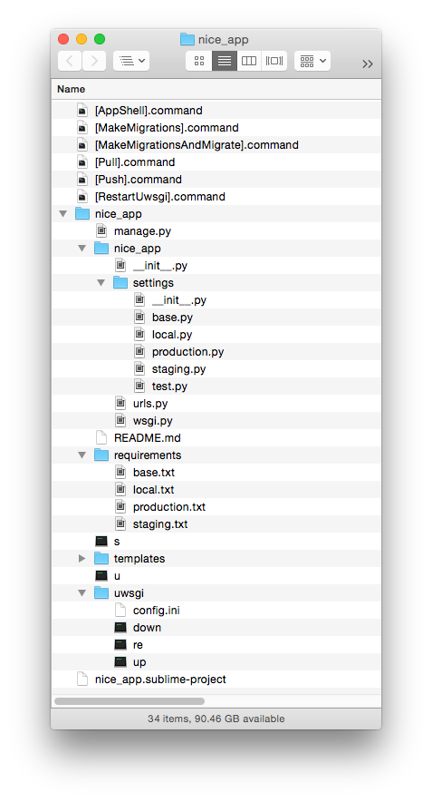

# InstaDjango

Some app ideas just can't wait another day, hour, or even minute. All you want to do is to start developing the web component of your app as soon as possible without the frustration of going through a tedious and potentially erroneous installation process of your web framework.

And if your favorite web framework happens to be Django, which is one of the most proficiently crafted and easy to use frameworks there are, InstaDjango might be exactly what you need to spin up a Django instance in the matter of seconds, especially if you'd rather prefer a GUI to editing Vagrant scripts or just want to minimize file editing in general.

<p align="center">
  
</p>

## Features

InstaDjango takes care of:

* **virtualenv**: as a standard practice, your app is installed into its own virtual environment.
* **uWSGI**: this communication layer between the web server and Django is installed and configured for your app automatically, providing you with easy ways to start up, shut down, and restart uWSGI.
* **Your app's requirements**.
* **Directory structures**: the files of your app are conveniently organized according to a quite reputable book [Two Scoops of Django: Best Practices for Django](http://twoscoopspress.org/products/two-scoops-of-django-1-8).
* **Deployment profiles**: the app's requirements and settings are split and logically chained to let you deploy for local development, production, staging (pre-production), or testing.
* **App's local directory**: ready to slide under a source control system, such as Git, the locally stored directory of your app reflects the relevant files located inside the remote directory on your server.
* **Secret key and password security**: unlike with manual installation, the sensitive information such as your app's secret key and your database's password are stored as environment variables in the virtual environment of your app on the server and not in the app's settings, thereby escaping the possibility of getting accidentally published (via Git).
* **Synchronization**: the generated rsync-based local scripts let you push changes from your local directory into the remote directory and, after managing your Django instance remotely, pull changes from the remote directory into the local one. The generated `[AppShell].command`, lets you push the changes to the server, make any changes you need on the server while in the server's shell (with the app's virtual environment activated automatically), and pull the changes to your local machine, all thanks to one extremely convenient script.
* **SSH-ing directly into the app's virtual environment**: no need to first SSH into the server, then go into the app's directory, and then manually activate the virtual environment because a locally prepared script will happily do this all for you.
* **Sublime Text integration**: InstaDjango assumes that you are a cool person already using one of the best Python IDEs for your app development, namely Sublime Text powered by [Anaconda](https://github.com/DamnWidget/anaconda), so it generates a Sublime Text project pre-configured to push changes into your app's remote directory and to restart uWSGI whenever you build the project.

## Usage

Just run `InstaDjango.py`, fill out the GUI form, and hit Go. You can make it even faster by hopping through the input fields with the <kbd>Tab</kbd> key!

Before letting it go, make sure that the parent directory where you want the app's remote directory to be created, such as `/var/www`, is owned by the remote user (which is you!) and not root. Otherwise, you may run into permission problems.

The domain info is primarily needed for an entry in the Django settings that restricts the app to a specific list of domains when running in production with `DEBUG` set to `False`.

If you are more used to editing source files by means of an FTP/SCP client instead of pushing changes with rsync, just delete the local directory and you're done (the remote directory is meant to be a superset of the local one).

When SSH-ed into the app's remote directory (with `[AppShell].command`), you can run

```sh
./u
```

which does the same as running `uwsgi/up` script and starts up uWSGI for the first time.

And you can use

```sh
. s
```

to activate the app's virtual environment if you needed to deactivate it for some reason.

After InstaDjango has finished, your app's local directory should look similar to this:

<p align="center">
  
</p>

At the root of the app's directory, `nice_app`, you can see the app's main module of the same name with `urls.py` and `wsgi.py` files and `settings` directory, which contains Django settings for local development, production, staging, and testing, all of which derive from the settings in `base.py`. The `requirements` directory follows the same principle for the requirements used by your Django instance (all the requirements are already installed but it's possible that you'd still need to add new requirements later). The `uwsgi` directory contains the uWSGI configuration along with the scripts to start up, shut down, and restart uWSGI.

Let's go over the shell scripts that are located outside of the app's local directory:

* **`[AppShell].command`** is for pushing the changes to the server, SSH-ing into the server's shell with the working directory changed to the app's remote directory and with the app's virtual environment already activated for you, and pulling any changes you make on the server after you are done with the shell (<kbd>Ctrl</kbd>+<kbd>D</kbd>). This script is meant to be run separate from editing your app's files locally so avoid keeping the app's shell of this script continuosly open in Terminal while modifying the source.
* **`[MakeMigrations].command`** is for pushing the changes to the server, running `python manage.py makemigrations`, and pulling the changes from the server. Use `[AppShell].command` when you aren't completely sure that migrations will go smoothly for your changes.
* **`[MakeMigrationsAndMigrate].command`** is for pushing the changes to the server, running `python manage.py makemigrations && python manage.py migrate`, and pulling the changes from the server. Use `[AppShell].command` when you aren't completely sure that migrations will go smoothly for your changes.
* **`[Push].command`** is for pushing changes from the local directory into the remote one. You may consider running `[RestartUwsgi].command` thereafter or simply joining the two scripts together.
* **`[Pull].command`** is for pulling changes from the remote directory into the local one.
* **`[RestartUwsgi].command`** is for restarting uWSGI on the server for the changes to Django files to take effect.

Now, let's compare the local structure to that of the app's remote directory:

<p align="center">
  
</p>

As you may have noticed, it's almost identical except the remote directory contains a subdirectory used by the app's virtual environment, `nice_app_venv`, which has very little to do with the design of your Django app and therefore is not present locally.

You don't get the directory for static files locally either because static files are supposed to be collected by Django from other directories inside the remote directory after you push those files from the local directory.

## Prerequisites

* OS X with Python 3 locally.
* An Ubuntu/Debian server with Python 3 and PIP remotely.
* A web server, such as Nginx, with Memcached. The configured uWSGI port is expected to be 8800.
* PostgreSQL for your server's database with postgresql-server-dev-*postgresql_ver* (MySQL support might be added with time).
* SSH access to the server using a private key and with the passphrase already in the OS X's keychain (if any).
